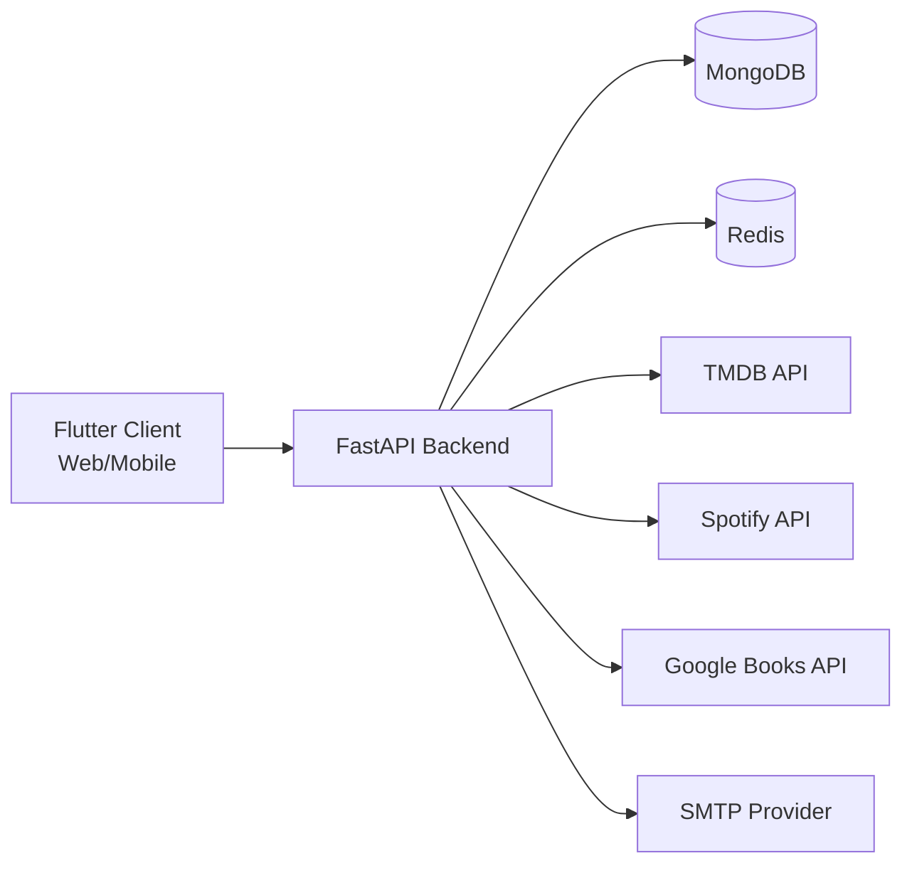

# Architecture

This document describes the current OmniSource architecture and its practical
path toward production-grade quality.

## 1. System Context


```

## 2. Runtime Components

### Client layer (`lib/`)

1. Authentication flows
2. Unified content feed/search screens
3. Library and playlists
4. Analytics event tracking

### Backend API layer (`server/app/api/routers/`)

1. `auth.py`: login/register/password reset
2. `content.py`: search/home/discovery/recommendations/image proxy
3. `actions.py`: events/timeline/stats/library actions
4. `user.py`, `research.py`, `recommendations.py`

### Service layer (`server/app/services/`)

1. `content_service.py`: provider fan-out + normalization + caching
2. `analytics_service.py`: event ingestion, stats, metadata sync
3. `library_service.py`: favorites/playlists and cache invalidation
4. `sync_service.py`: metadata snapshot synchronization

### ML layer (`server/app/ml/`)

1. `vectorizer.py`: sentence-transformer embeddings with fallback
2. `engine.py`: weighted interaction profile + cosine ranking
3. `similarity.py`: vector similarity primitives

### Data layer

MongoDB collections:

1. `users`
2. `interactions`
3. `content_metadata`
4. `playlists`
5. `password_resets`

Redis usage:

1. content/recommendation response caching
2. library and playlist detail caches
3. deep-research and user recommendation cache keys

## 3. Main Data Flows

### 3.1 Content Discovery

1. Client calls `/content/search`, `/content/home`, `/content/discover`
2. API delegates to `ContentService`
3. Service fetches from external providers in parallel
4. Mapper + sanitizer normalize `UnifiedContent`
5. Result is cached in Redis and returned

### 3.2 Personalization

1. Client sends interaction events to `/actions/event`
2. `AnalyticsService` stores interaction and syncs metadata vectors
3. `/content/recommendations` checks user mode:
   `content_only` or `hybrid_ml`
4. `RecommenderEngine` ranks candidates by similarity + quality score

### 3.3 Auth and Session

1. Login/register produce project-owned JWT
2. JWT is used for API authorization
3. Password reset flow:
   secure token generation, hash storage, TTL expiration
4. Rate-limit guards login/reset endpoints

## 4. Caching Strategy

Redis:

1. short-lived hot caches (search/home/discovery/favorites)
2. recommendation caches per user and content type
3. explicit invalidation on library mutations

In-process image cache:

1. host allowlist + payload size checks
2. TTL + item limit + total byte budget
3. in-flight dedup for concurrent identical requests

## 5. Security Baseline

1. JWT-based API auth with token versioning
2. Password reset tokens stored as hashes
3. Endpoint-level rate limits on auth-sensitive routes
4. CI includes SAST (`bandit`) and dependency audit (`pip-audit`)
5. Dependency policy is tracked in `server/DEPENDENCY_POLICY.md`

## 6. Observability

1. `/health` endpoint for liveness checks
2. `/metrics` endpoint for Prometheus-style metrics
3. Request counters and latency sums
4. App-level degradation counters for content service errors

## 7. Deployment Topology

Current stack:

1. `docker-compose.yml` orchestrates:
   API + MongoDB + Redis
2. Backend image: `server/Dockerfile`
3. Persistent volumes:
   MongoDB data, Redis data, HuggingFace model cache

## 8. Current ML Maturity

Current level:

1. practical semi-ML recommendation pipeline
2. pretrained embedding model + heuristic scoring
3. no in-project supervised training pipeline yet

Planned diploma-grade upgrade:

1. trainable recommendation model (implicit feedback)
2. offline evaluation (`Recall@K`, `NDCG@K`)
3. model artifact versioning and scheduled retrain
4. A/B comparison against current baseline

## 9. Architectural Roadmap

Near-term:

1. OAuth2 as additional login provider
2. Celery/worker queue for background heavy tasks
3. distributed auth rate-limit via Redis
4. stronger deployment profiles (staging/prod)

Medium-term:

1. full ML training pipeline
2. experiment tracking and offline/online metrics
3. autoscaling and resource-aware model serving
